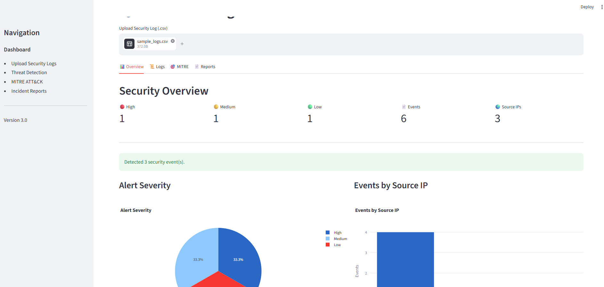

# 🛡 AI SOC Investigation Assistant

A Python-based Security Operations Center (SOC) dashboard that analyzes security logs, detects suspicious activity, maps findings to the MITRE ATT&CK framework, and generates incident reports.

This project demonstrates practical cybersecurity analysis skills using Python, Streamlit, Pandas, and Plotly.

---

## 📸 Dashboard

> Add screenshots after completing the project.

### Overview


### Security Logs


### MITRE ATT&CK Mapping


### Incident Reports


---

# Features

- 📂 Upload security log files (CSV)
- 🔍 Search events by source IP
- 🚨 Detect SSH brute-force attacks
- ⚡ Detect PowerShell execution
- 📁 Detect suspicious file access
- 📊 Interactive security dashboard
- 📈 Alert severity visualization
- 🌍 Source IP statistics
- 🎯 MITRE ATT&CK technique mapping
- 📄 Generate incident reports
- 📥 Download reports and logs

---

# Detection Capabilities

## SSH Brute Force Detection

Detects:

- Three or more failed SSH login attempts
- Followed by a successful login
- Flags as High severity

---

## PowerShell Detection

Detects:

- PowerShell execution events

Severity:

Medium

---

## Sensitive File Access

Detects:

- File access activity

Severity:

Low

---

# Dashboard

The dashboard provides:

- High / Medium / Low alert counts
- Total log events
- Unique source IP addresses
- Alert severity pie chart
- Events by source IP bar chart
- Indicators of Compromise (IOCs)
- Incident reports

---

# MITRE ATT&CK Mapping

| Detection | Technique |
|-----------|-----------|
| SSH Brute Force | T1110 |
| PowerShell Execution | T1059.001 |
| Sensitive File Access | T1005 |

---

# Technologies Used

- Python
- Streamlit
- Pandas
- Plotly
- Git
- GitHub

---

# Project Structure

```
AI-SOC-Investigation-Assistant/
│
├── app.py
├── README.md
├── requirements.txt
│
├── data/
│   └── sample_logs.csv
│
├── screenshots/
│   ├── dashboard.png
│   ├── logs.png
    ├── logs2.png   
│   ├── mitre.png
│   └── reports.png
│
└── src/
    ├── analyzer.py
    ├── parser.py
    ├── mitre_mapper.py
    ├── report_generator.py
    └── models.py
```

---

# Installation

Clone the repository:

```bash
git clone https://github.com/YOUR_USERNAME/AI-SOC-Investigation-Assistant.git
```

Move into the project folder:

```bash
cd AI-SOC-Investigation-Assistant
```

Install dependencies:

```bash
pip install -r requirements.txt
```

Run the application:

```bash
streamlit run app.py
```

---

# Sample Security Events

Example events include:

- SSH Login Failed
- SSH Login Success
- PowerShell Execution
- File Access

---

# Future Improvements

- 🤖 AI-generated investigation summaries
- 📄 PDF incident reports
- ☁️ Streamlit Cloud deployment
- 🐳 Docker containerization
- 🔐 Additional detection rules
- 📊 Timeline visualization
- 🌙 Dark mode
- 🔍 IOC enrichment
- 🌐 Threat intelligence integration

---

# Skills Demonstrated

- Python Programming
- Security Log Analysis
- Threat Detection
- MITRE ATT&CK
- Data Visualization
- Streamlit Application Development
- Pandas Data Analysis
- Cybersecurity Reporting
- Git Version Control

---

# Author

**Kayoung Lee**

Bachelor of Science in Cybersecurity and Information Assurance 

Passionate about Security Operations (SOC), Threat Detection, Incident Response, and Blue Team cybersecurity.

---

# License

This project is intended for educational and portfolio purposes.