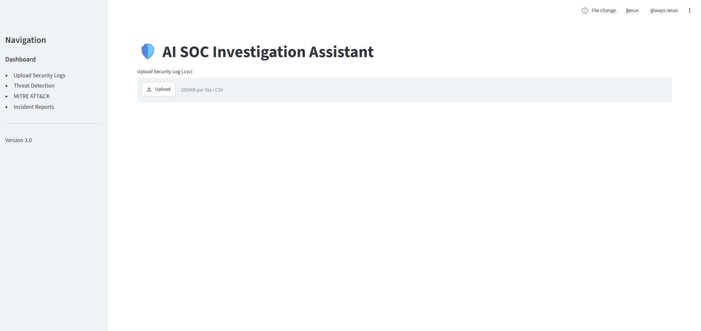
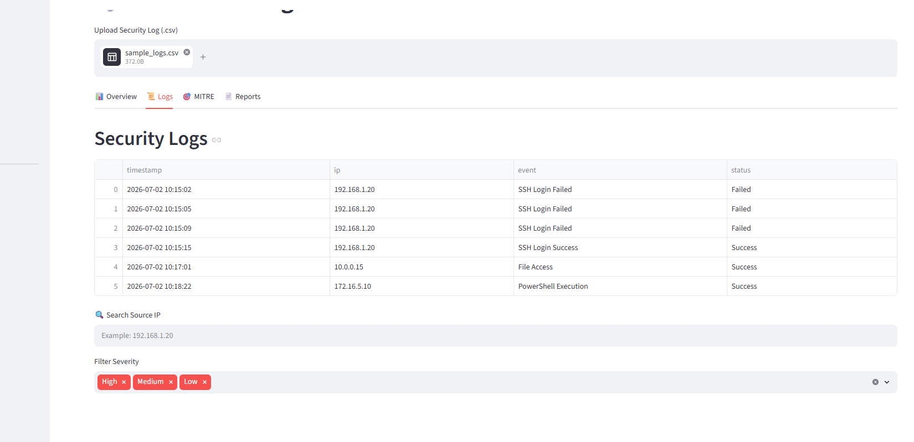
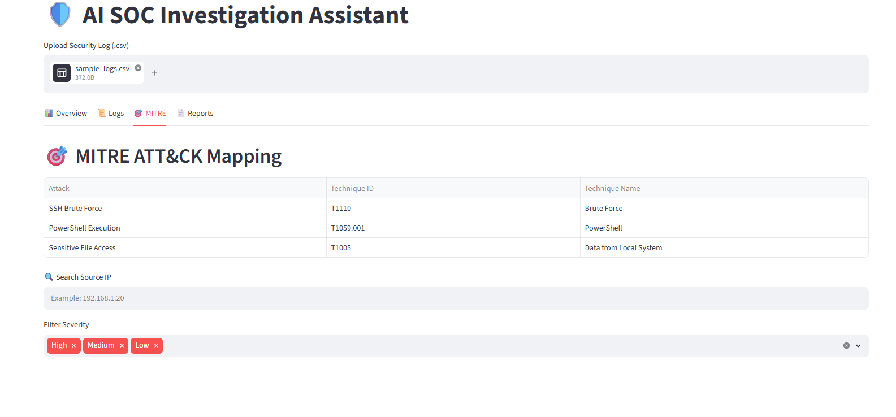
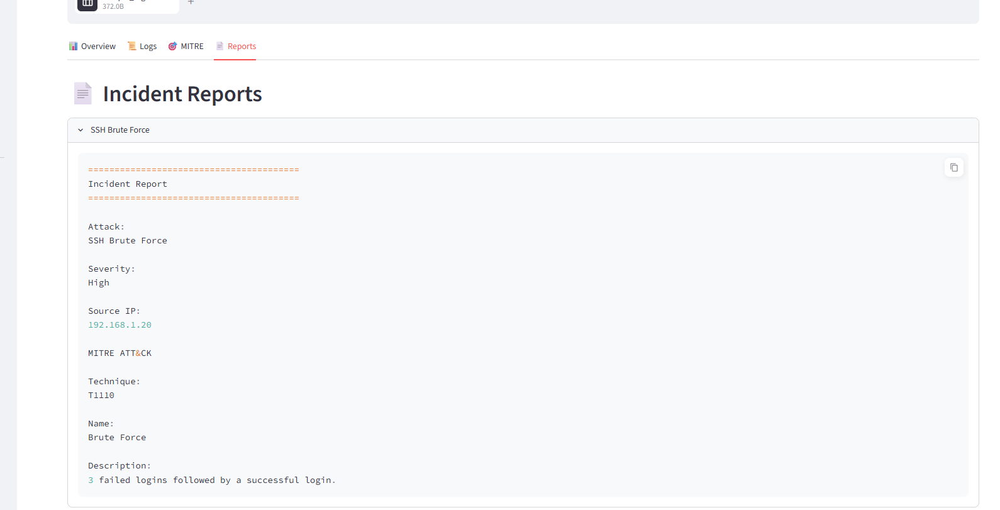

# 🛡 AI SOC Investigation Assistant

An interactive Security Operations Center (SOC) dashboard built with **Python**, **Streamlit**, **Pandas**, and **Plotly**. The application analyzes security logs, detects suspicious activity, maps findings to the **MITRE ATT&CK** framework, and generates downloadable incident reports.

---

# 📌 Overview

The AI SOC Investigation Assistant simulates a Security Operations Center (SOC) workflow by allowing analysts to upload security logs, identify suspicious activities, visualize security events, and generate investigation reports.

This project demonstrates practical cybersecurity, Python programming, and data visualization skills commonly used in SOC Analyst and Blue Team roles.

---

# 🚀 Features

* 📂 Upload CSV security log files
* 🔍 Search logs by Source IP
* 🚨 Detect SSH brute-force attacks
* ⚡ Detect PowerShell execution
* 📁 Detect suspicious file access
* 📊 Interactive security dashboard
* 🥧 Alert severity pie chart
* 📈 Events by Source IP chart
* 🎯 MITRE ATT&CK mapping
* 📄 Incident report generation
* 📥 Download investigation reports

---

# 📸 Screenshots

## 🖥 Dashboard



---

## 📜 Security Logs

### All Security Events


### Search / Filter Example



---

## 🎯 MITRE ATT&CK Mapping



---

## 📄 Incident Reports



---

# 🛡 Detection Rules

## SSH Brute Force Detection

**Detection Logic**

* Three or more failed SSH login attempts
* Followed by a successful login

**Severity:** High

---

## PowerShell Execution

Detects PowerShell execution events.

**Severity:** Medium

---

## Sensitive File Access

Detects suspicious file access activity.

**Severity:** Low

---

# 📊 Dashboard

The dashboard provides:

* High / Medium / Low alert counts
* Total security events
* Unique source IP addresses
* Alert severity distribution
* Events by Source IP visualization
* Security log viewer
* MITRE ATT&CK mapping
* Downloadable incident reports

---

# 🎯 MITRE ATT&CK Techniques

| Detection             | Technique                      |
| --------------------- | ------------------------------ |
| SSH Brute Force       | T1110 – Brute Force            |
| PowerShell Execution  | T1059.001 – PowerShell         |
| Sensitive File Access | T1005 – Data from Local System |

---

# 🛠 Technologies

* Python
* Streamlit
* Pandas
* Plotly
* Git
* GitHub

---

# 📂 Project Structure

```text
ai-soc-investigation-assistant/
│
├── app.py
├── README.md
├── requirements.txt
├── .gitignore
│
├── data/
│   └── sample_logs.csv
│
├── screenshots/
│   ├── dashboard.png
│   ├── log.png
│   ├── logs2.png
│   ├── mitre.png
│   └── reports.png
│
└── src/
    ├── analyzer.py
    ├── parser.py
    ├── mitre_mapper.py
    ├── report_generator.py
    └── models.py
```

---

# ⚙ Installation

Clone the repository:

```bash
git clone https://github.com/Klee815/ai-soc-investigation-assistant.git
```

Move into the project folder:

```bash
cd ai-soc-investigation-assistant
```

Install dependencies:

```bash
pip install -r requirements.txt
```

Run the application:

```bash
streamlit run app.py
```

---

# 📄 Sample Security Events

The included sample dataset demonstrates:

* SSH Login Failed
* SSH Login Success
* PowerShell Execution
* File Access

---

# 💼 Skills Demonstrated

* Python Programming
* Cybersecurity Log Analysis
* Threat Detection
* MITRE ATT&CK Framework
* Incident Response
* Data Visualization
* Streamlit Development
* Git & GitHub
* Security Reporting

---

# 🚀 Future Improvements

* 🤖 AI Investigation Assistant
* 📄 PDF Report Export
* 🌐 Threat Intelligence Integration
* 📊 Timeline Visualization
* 🐳 Docker Deployment
* ☁️ Streamlit Community Cloud Deployment

---

# 👤 Author

**Kayoung Lee**

Bachelor of Science in Cybersecurity and Information Assurance (WGU)

Aspiring SOC Analyst passionate about Threat Detection, Incident Response, SIEM, Blue Team operations, and Security Automation.

---

# 📄 License

This project is intended for educational and portfolio purposes.
